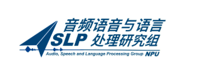

    

OSUM <a href=""> 敬请期待</a> </a>&nbsp
 
📑 <a href="">Paper</a> &nbsp&nbsp | &nbsp&nbsp 📑 <a href="https://aslp-lab.github.io/OSUM.github.io/">Demo</a> &nbsp&nbsp | &nbsp&nbsp 💬 <a href="raw/fig/wechat.png">WeChat (微信)</a>&nbsp&nbsp 

We present OSUM, an open-source SULM designed to encourage broader research participation with minimal resource requirements. OSUM integrates a Whisper speech encoder, fine-tuned on a multi-task dataset, with a Qwen2 LLM. It supports various speech tasks, including <b>ASR</b>, <b>SRWT</b>, <b>VED</b>, <b>SER</b>, <b>SSR</b>, <b>SGC</b>, <b>SAP</b>, and <b>STTC</b>. Notably, <b>SSR</b> enhances speech generation by ensuring appropriate styles for natural interactions.  

To improve training efficiency and stability, we adopt an ASR+X strategy, where an auxiliary ASR task is trained alongside the primary task (X), accelerating modality alignment between text and audio. OSUM uses 44,100 hours of training data and achieves competitive performance. It is trained on Nvidia A6000 GPUs and Huawei Ascend NPUs, supporting inference on both platforms.  

Our goal is to foster transparency and accelerate SULM research by providing accessible tools and resources to the community.

## Architecture

The overview of the architecture and tasks of OSUM.

    

